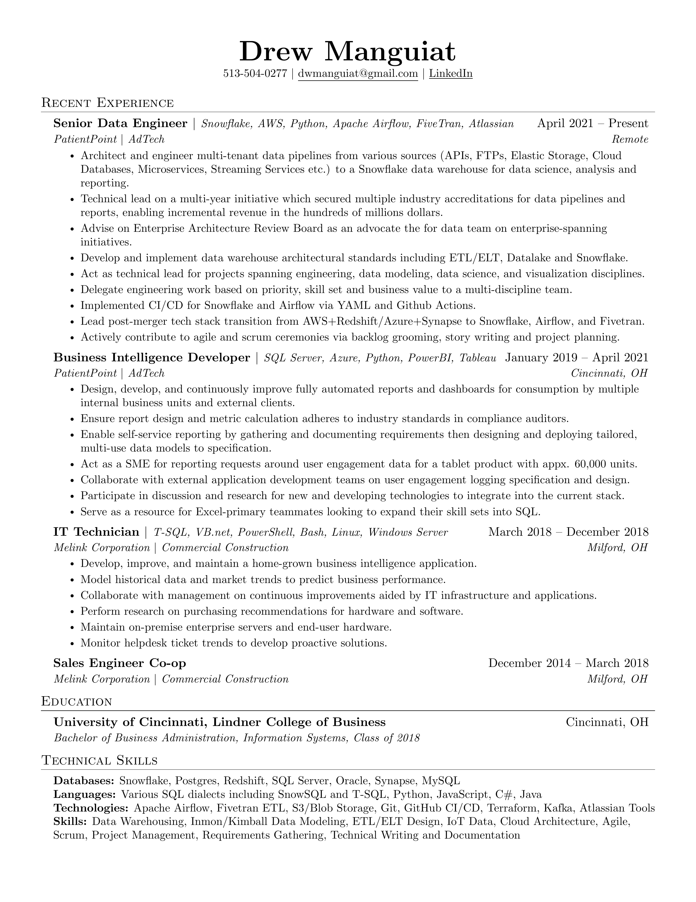

## About

This repository stores my LaTeX-authored resume. On every push to `master`, a GitHub Actions workflow automatically compiles the `.tex` source into a PDF and renders it as a PNG — keeping the rendered outputs always in sync with the source.

## Workflow

```
┌─────────────────┐
│  Edit resume.tex │
└────────┬────────┘
         │ git push → master
         ▼
┌─────────────────────────────────────────────────┐
│              GitHub Actions                      │
│                                                  │
│  1. Install TeX Live + poppler-utils             │
│  2. pdflatex resume.tex  →  resume.pdf           │
│  3. pdftoppm resume.pdf  →  resume.png           │
│  4. Commit & push rendered files [skip ci]       │
└─────────────────────────────────────────────────┘
         │
         ▼
┌──────────────────┐
│  resume.pdf      │
│  resume.png      │  ← committed back to master
└──────────────────┘
```
