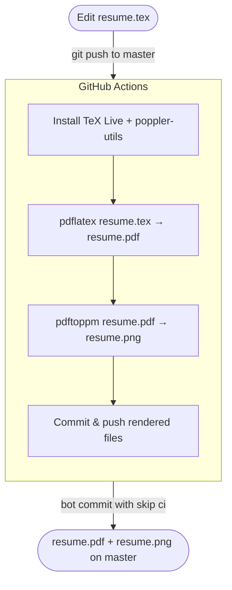

## About

This repository stores my LaTeX-authored resume. On every push to `master`, a GitHub Actions workflow automatically compiles the `.tex` source into a PDF and renders it as a PNG — keeping the rendered outputs always in sync with the source.

## Workflow

